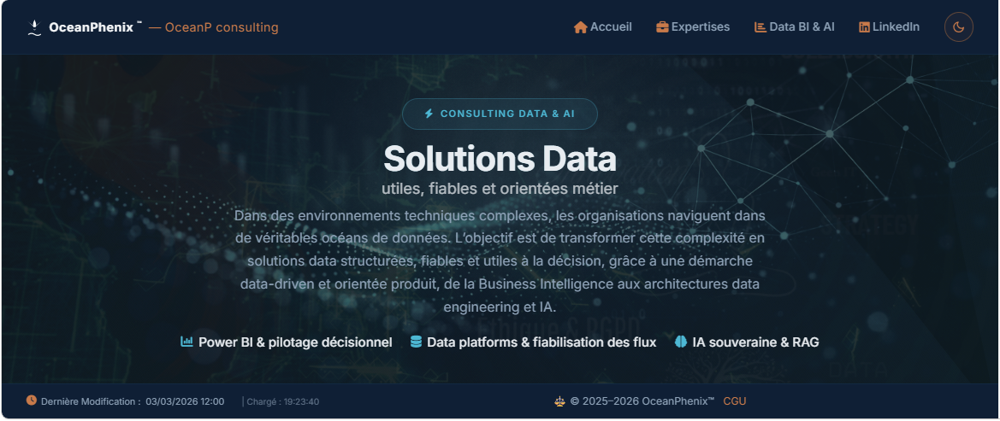

  

# Stéphane Celton

**Senior Data Product Manager · BI · Gouvernance Data · Production IT  - Founder Oceanphenix - oceanpconsulting**

---

## Parcours — de la production industrielle à la data

Senior Data Product Manager / BI / Data Governance avec 15+ ans d’expérience dans des environnements critiques : Coca-Cola, EDF, BNP Paribas, BPCE, GRDF, Dassault Aviation,  et Crédit Agricole.
Safran
Mon parcours a évolué progressivement de l’industrie vers la data, en passant par la production IT, la Business Intelligence et aujourd’hui le pilotage de produits data  BI ou IA.

### 🎯 Chef de projet & Data Product Manager, Expert BI 

Aujourd'hui : cadrage des usages data, définition de la roadmap produit, priorisation orientée valeur métier, ownership fonctionnel des assets data. Pilotage Agile/Scrum, coordination MOA/MOE, livraisons en environnements exigeants.

---

**Ma conviction** : un bon chef de produit data doit comprendre la technique. Pas pour tout faire seul — mais pour cadrer juste, arbitrer vite et garantir la qualité de ce qui est livré. Ce parcours terrain, de la ligne de production industrielle à la gouvernance data, c'est ce qui fait la différence.

### Secteurs d'intervention

Banque & Assurance · Énergie · Industrie · Aéronautique & Défense · Santé & Services publics

---

## Diplômes & Certifications

### IT — RNCP

| Diplôme | Établissement | Période |
|---|---|---|
| **Data Product Manager (RNCP 7)** | Mines Paris -Datascientest.com | 2024 – 2025 |
| ↳ RNCP36129BC01 — Élaborer une solution IA grâce au Design Thinking | Mines Paris -Datascientest.com | 2024 – 2025 |
| ↳ RNCP36129BC02 — Piloter un projet IA | Mines Paris -Datascientest.com |2024 – 2025 |
| ↳ *Projet soutenance : DataScientest Learn — Optimiser les conditions d'apprentissage d'une plateforme e-learning*  |
| **Concepteur Développeur N-Tiers (Bac+4)** | IPI Institut · IGS | 2014 – 2015 |
| **Technicien Supérieur Systèmes & Réseaux (Bac+2)** | IPI Institut · IGS | 2006 – 2007 |

---

## Compétences

| Domaine | Technologies & Méthodes |
|---|---|
| **Cloud & Infrastructure** | Azure, AWS, PaaS, SaaS, Environnements hybrides |
| **Gestion Produit Data** | Roadmap, KPIs, Priorisation, Modélisations |
| **Outils BI & Analytics** | Power BI, DAX, M, SSIS, Dataiku, Report Server |
| **Langages, BDD & IA** | SQL Server, PostgreSQL, T-SQL, Python, Pandas, NumPy, scikit-learn, LLM/LM |
| **Méthodologies** | SPC, Scrum, Kanban, 6 Sigma, DMAIC, ITIL, ITSM, Design Thinking, UX-UI |
| **Outils collaboratifs** | Jira, Confluence, O365, ServiceNow |
| **Supervision & Ordonnancement** | VTOM, TWS, Centreon, Control-M |

---

## Extension technique — ce que je sais aussi faire

Un Data Product Manager crédible, c'est quelqu'un qui peut ouvrir le capot. Je développe, je déploie, j'architecture — pas par titre, mais par nécessité et par conviction.

**BI & Data Engineering** · Power BI · DAX · TMDL · Semantic Models · Azure Analysis Services · SQL · PostgreSQL · Superset  
**DevOps & Infrastructure** · Docker · Docker Compose · Git · CI/CD · Self-hosted · MinIO S3 · N8n  
**IA Souveraine & RAG** · Ollama · Qdrant · OpenWebUI · FastAPI · Python · Embeddings · LLM locaux  
**Observabilité** · Grafana · Prometheus · cAdvisor  
**Web** · Astro · HTML/CSS · JavaScript

---

## Projets & Dépôts

### Data & IA

| Quelques Projet récents d'actualité  2025 -2026  | Description |
|---|---|
| [oceanphenix.fr](https://github.com/stepstev/oceanphenix.fr) | Site portfolio professionnel — Astro, GitHub Pages |
| [rag-platform-2026-public](https://github.com/stepstev/rag-platform-2026-public) | Stack RAG publique 2026 — modulaire, souveraine, Docker Compose |
| [oceanphenix-IA-souveraine-v10_2026_DOCS](https://github.com/stepstev/oceanphenix-IA-souveraine-v10_2026_DOCS) | Documentation plateforme IA souveraine V10 |
| [RAGchatOP](https://github.com/stepstev/RAGchatOP) | RAGchatOP — OpenWebUI + serveur T640 |
| [BOTAI](https://github.com/stepstev/BOTAI) | Bot IA basé sur Groq (Fast AI Inference) |

## Approche

Chaque projet data commence par une question métier, pas par un choix technologique.

Je privilégie les architectures pragmatiques, la souveraineté des données et l'industrialisation progressive. L'objectif n'est jamais la technologie pour elle-même, mais la valeur délivrée — un reporting fiable, une décision éclairée, un flux maîtrisé.

**OceanPhenix** incarne cette vision : résilience, structuration et transformation data au service de la décision.

---

## Souveraineté & Gouvernance des données

Les projets exploratoires data et IA soulèvent des enjeux majeurs : **RGPD**, **gouvernance des données**, **souveraineté numérique**. Mes projets explorent des approches data et IA maîtrisées — self-hosted, architectures hybrides — afin de mieux contrôler les infrastructures et les données.

---

<h2 align="center">📬 Contact</h2>

  
  
  
  
  

